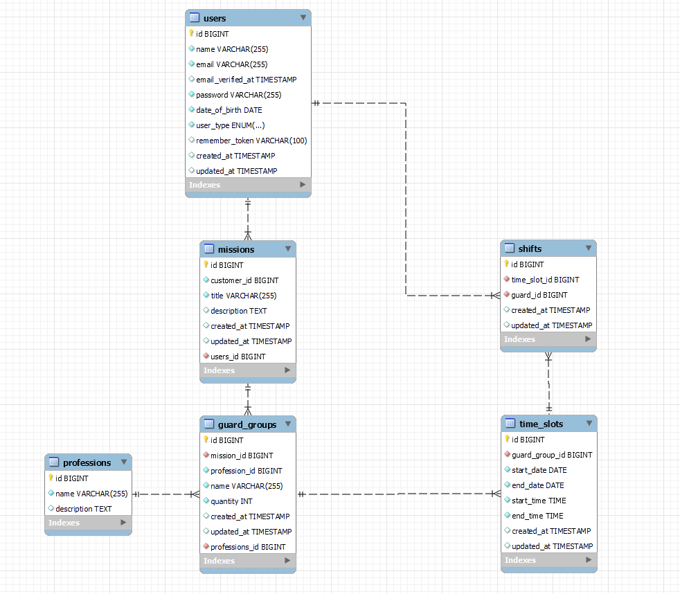

# Security Guard Management System

This project is a technical assessment demonstrating full-stack development skills using Laravel, React, and Inertia.js. The system includes two main parts: a user management admin panel and a RESTful API for mission booking operations.

---

## Quick Links

<div align="center">

[](http://34.40.93.77:82)
[](https://www.postman.com/planetary-spaceship-939256/guard-management-system/overview)

</div>

---

## Project Overview

This assessment is divided into two parts:

### Part 1: Admin Panel (Web Interface)
A complete user management system with authentication, CRUD operations, search/filter functionality, and data visualization features. Built using Laravel with Inertia.js and React for the frontend.

### Part 2: RESTful API
A mission booking API following REST principles with Sanctum authentication. Includes CRUD operations for missions, professions, and guard groups.

---

## Database Schema

### Entity Relationship Diagram



## Setup and Installation


### Installation Steps

1. Clone the repository
```bash
git clone https://github.com/MaherRemita/security-guard-management-system.git
```

2. Install PHP dependencies
```bash
composer install
```

3. Install JavaScript dependencies
```bash
npm install
```

4. Run migrations and seeder
```bash
php artisan migrate --seed
```

5. Build frontend assets
```bash
npm run build
```
6. Start the development servers
```bash
php artisan dev
```

The application will be available at `http://localhost:8000`

### Default Admin Credentials

```
Email: maher@admin.com
Password: password
```
---

## Design Patterns

### Service Layer Pattern

All business logic is abstracted into service classes (`app/Services`) to keep controllers lean and focused on HTTP handling. This provides:

- **Separation of Concerns**: Controllers handle HTTP, Services handle business logic
- **Reusability**: Services can be used across multiple controllers
- **Testability**: Business logic can be tested independently
- **Maintainability**: Changes to business logic are isolated
